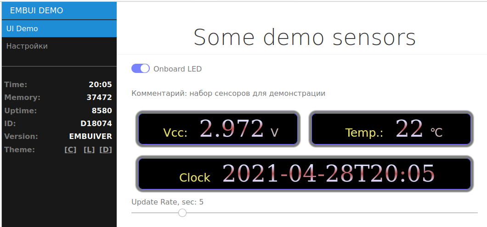

# EmbUI Example

### Dynamic Sensors display/update template

Шаблон проекта демонстрирующий способы отображения информации с различных сенсоров

  - Формирование "дисплеев" на странице
    - дисплей представляет из себя div с текстовым содержимым на основе специального CSS стиля
    - Стили можно использовать как свои так и встроенный в фреймворк стиль по-умолчанию
    - обновление данных на дисплее производится через периодическую отсылку пар id:value, данные обновляются на "дисплее" с соответсвующим id

Установка:

 - в папку data развернуть файлы фреймворка из архива /resources/data.zip
 - собрать проект в platformio
 - залить FS в контроллер `pio run -t uploadfs`
 - залить прошивку в контроллер `pio run -t upload`

mklittlefs.exe вы можете найти по ссылке https://github.com/earlephilhower/mklittlefs , из фреймворка он удален, в связи с ограничениями публикации библиотеки
